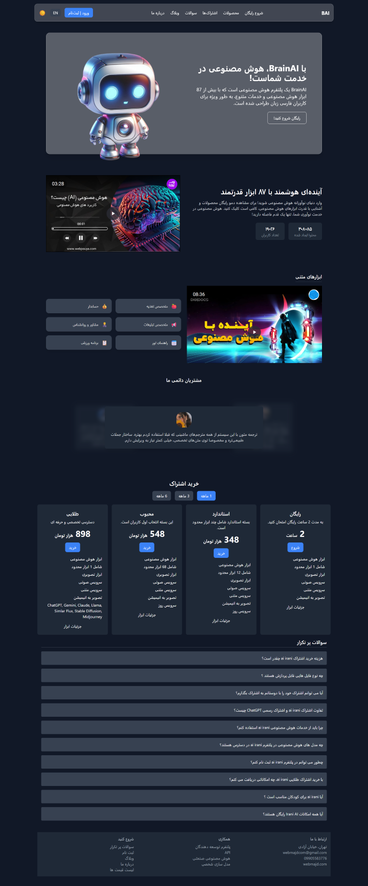

# AI Landing Page (Frontend-Brain-AI)

<div dir="rtl" align="right">

یک صفحه فرود (Landing Page) مدرن و کاملاً واکنش‌گرا که با الهام از طراحی‌های پیشرفته و با استفاده از React.js و CSS مدرن ساخته شده است. این پروژه نمونه‌ای عالی از یک رابط کاربری جذاب برای معرفی یک محصول یا سرویس مبتنی بر هوش مصنوعی است.

</div>

<div align="center">
  
</div>

<p align="center">
  <a href="https://webmajd.github.io/Frontend-Brain-AI/" target="_blank"><strong>View Live Demo »</strong></a>
</p>

<p align="center">
  <a href="https://github.com/webmajd/Frontend-Brain-AI/issues">Report Bug</a>
  ·
  <a href="https://github.com/webmajd/Frontend-Brain-AI/issues">Request Feature</a>
</p>

---

## About The Project | درباره پروژه

<div dir="ltr" align="left">

This project is a fully responsive, modern UI/UX website for a conceptual GPT-3 powered service. It was developed using React.js and follows best practices for creating reusable components and a clean code structure. The design is futuristic and aims to capture the essence of artificial intelligence, making it a perfect template for tech startups and AI-related products.

Every section is crafted as a separate component, making the codebase modular, scalable, and easy to maintain.

</div>

<br>

<div dir="rtl" align="right">

این پروژه یک وب‌سایت کاملاً واکنش‌گرا با رابط کاربری (UI/UX) مدرن برای یک سرویس مفهومی مبتنی بر GPT-3 است. این پروژه با استفاده از React.js و با پیروی از بهترین شیوه‌ها برای ایجاد کامپوننت‌های قابل استفاده مجدد و ساختار کد تمیز توسعه داده شده است. طراحی آینده‌نگرانه آن با هدف به تصویر کشیدن جوهره هوش مصنوعی انجام شده و آن را به یک قالب عالی برای استارت‌آپ‌های فناوری و محصولات مرتبط با AI تبدیل می‌کند.

هر بخش به عنوان یک کامپوننت مجزا طراحی شده که این امر باعث ماژولار بودن، مقیاس‌پذیری و نگهداری آسان کدبیس می‌شود.

</div>

---

### Features | ویژگی‌ها

<div dir="ltr" align="left">

- **Stunning UI/UX:** A visually appealing design with modern gradients and layout.
- **Component-Based Architecture:** Built with React, featuring reusable components for features, articles, CTAs, and more.
- **Fully Responsive:** Ensures a seamless experience across all devices, from mobile phones to desktops.
- **Clean Codebase:** Well-organized and commented code for developer-friendliness.
- **CSS BEM Methodology:** Styles are written following the BEM (Block, Element, Modifier) convention for scalable and maintainable CSS.
- **Interactive Elements:** Smooth navigation and interactive sections to engage users.

</div>

<br>

<div dir="rtl" align="right">

- **UI/UX خیره‌کننده:** طراحی بصری جذاب با گرادینت‌ها و طرح‌بندی مدرن.
- **معماری مبتنی بر کامپوننت:** ساخته شده با React، شامل کامپوننت‌های قابل استفاده مجدد برای ویژگی‌ها، مقالات، دکمه‌های فراخوان (CTA) و غیره.
- **کاملاً واکنش‌گرا:** تضمین تجربه کاربری یکپارچه در تمام دستگاه‌ها، از موبایل تا دسکتاپ.
- **کدبیس تمیز:** کد سازمان‌یافته و کامنت‌گذاری شده برای سهولت کار توسعه‌دهندگان.
- **متدولوژی BEM در CSS:** استایل‌ها با پیروی از قرارداد BEM (Block, Element, Modifier) نوشته شده‌اند که باعث مقیاس‌پذیری و نگهداری آسان CSS می‌شود.
- **عناصر تعاملی:** ناوبری روان و بخش‌های تعاملی برای درگیر کردن کاربران.

</div>

---

### Built With | تکنولوژی‌های استفاده شده

This project leverages the power of modern frontend technologies to deliver a high-performance, visually rich experience.

* **[React.js](https://reactjs.org/)**
* **CSS3 (with BEM methodology)**
* **JavaScript (ES6+)**

---

## Getting Started | راه‌اندازی پروژه

To get a local copy up and running, follow these simple steps.

### Prerequisites | پیش‌نیازها

You need to have Node.js and npm (or yarn) installed on your machine.

* npm
    ```sh
    npm install npm@latest -g
    ```

### Installation | نصب

1.  Clone the repo:
    ```sh
    git clone [https://github.com/webmajd/Frontend-Brain-AI.git](https://github.com/webmajd/Frontend-Brain-AI.git)
    ```
2.  Navigate to the project directory:
    ```sh
    cd Frontend-Brain-AI
    ```
3.  Install NPM packages:
    ```sh
    npm install
    ```
4.  Run the app in development mode:
    ```sh
    npm start
    ```
    Open [http://localhost:3000](http://localhost:3000) to view it in your browser.

---

## Usage | نحوه استفاده

<div dir="ltr" align="left">

This project serves as an excellent starting point or template for anyone looking to build a modern landing page for a tech product. You can customize the components, text, and branding to fit your own needs.

The project structure is organized as follows:
- `src/components`: Contains all reusable React components (`Article`, `Brand`, `CTA`, `Feature`, `Navbar`).
- `src/containers`: Contains the main sections of the page (`Blog`, `Features`, `Footer`, `Header`, `Possibility`, `WhatGPT3`).
- `src/assets`: Stores all static assets like images and logos.
- `App.js` & `App.css`: The main component that assembles the page and its global styles.
- `index.js` & `index.css`: The entry point of the React application and root styles.

</div>

<br>

<div dir="rtl" align="right">

این پروژه به عنوان یک نقطه شروع یا قالب عالی برای هر کسی است که به دنبال ساخت یک صفحه فرود مدرن برای یک محصول فناوری است. شما می‌توانید کامپوننت‌ها، متون و برندینگ را مطابق با نیازهای خود سفارشی کنید.

ساختار پروژه به شرح زیر است:
- `src/components`: شامل تمام کامپوننت‌های قابل استفاده مجدد ری‌اکت (`Article`, `Brand`, `CTA`, `Feature`, `Navbar`).
- `src/containers`: شامل بخش‌های اصلی صفحه (`Blog`, `Features`, `Footer`, `Header`, `Possibility`, `WhatGPT3`).
- `src/assets`: محل ذخیره‌سازی تمام فایل‌های استاتیک مانند تصاویر و لوگوها.
- `App.js` و `App.css`: کامپوننت اصلی که تمام بخش‌های صفحه را کنار هم قرار می‌دهد و استایل‌های سراسری.
- `index.js` و `index.css`: نقطه ورود اپلیکیشن ری‌اکت و استایل‌های ریشه.

</div>

---

## Contributing | مشارکت در پروژه

<div dir="ltr" align="left">

Contributions are what make the open-source community such an amazing place to learn, inspire, and create. Any contributions you make are **greatly appreciated**.

If you have a suggestion that would make this better, please fork the repo and create a pull request. You can also simply open an issue with the tag "enhancement". Don't forget to give the project a star! Thanks again!

1.  Fork the Project
2.  Create your Feature Branch (`git checkout -b feature/AmazingFeature`)
3.  Commit your Changes (`git commit -m 'Add some AmazingFeature'`)
4.  Push to the Branch (`git push origin feature/AmazingFeature`)
5.  Open a Pull Request

</div>

<br>

<div dir="rtl" align="right">

مشارکت‌ها چیزی هستند که جامعه متن‌باز را به مکانی شگفت‌انگیز برای یادگیری، الهام گرفتن و خلق کردن تبدیل می‌کنند. هرگونه مشارکتی از جانب شما **بسیار مورد قدردانی** قرار خواهد گرفت.

اگر پیشنهادی برای بهتر کردن این پروژه دارید، لطفاً ریپازیتوری را فورک کرده و یک پول ریکوئست ایجاد کنید. همچنین می‌توانید به سادگی یک ایشو (issue) با تگ "enhancement" باز کنید. فراموش نکنید که به پروژه ستاره بدهید! با تشکر!

۱. پروژه را فورک کنید.
۲. شاخه ویژگی خود را ایجاد کنید (`git checkout -b feature/AmazingFeature`).
۳. تغییرات خود را کامیت کنید (`git commit -m 'Add some AmazingFeature'`).
۴. به شاخه خود پوش کنید (`git push origin feature/AmazingFeature`).
۵. یک پول ریکوئست باز کنید.

</div>

---

## License | مجوز

Distributed under the MIT License. See `LICENSE` for more information.

---

## Contact | تماس

Majd - [@webmajd](https://github.com/webmajd) - webmajdcom@gmail.com

Project Link: [https://github.com/webmajd/Frontend-Brain-AI](https://github.com/webmajd/Frontend-Brain-AI)

Live Demo: [https://webmajd.github.io/Frontend-Brain-AI/](https://webmajd.github.io/Frontend-Brain-AI/)

</div>